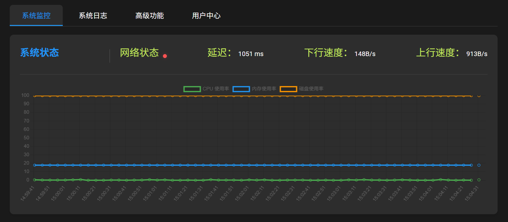
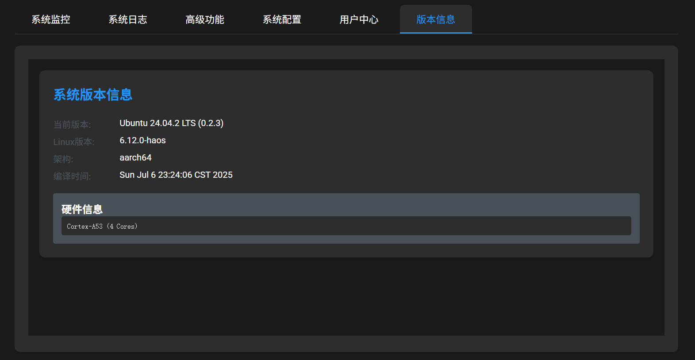

# Home Assistant OS H618-k2b & rk3399-custom Build System

本工程为 Home Assistant OS 在 Allwinner H618-k2b 和 Rockchip RK3399 平台的完整构建系统，支持内核、U-Boot、固件、根文件系统、分区镜像等一站式自动化编译与打包。

---

## 开发进度 

- ✅主板适配：H681-kicpi-K2B、rk3399 like pc(一块类似rk3399pc的板子，姑且命名为rk3399-custom) 
- ✅ubuntu系统构建
- ✅haos-core 构建
- ✅分区划分
- ✅启动自动执行ha
- ✅OTA升级功能
- ❌nmcil 连接wifi后，可以连接，dbus超时 待解决
- ✅系统瘦身
- ✅linux下uboot环境变量配置
- ✅无终端配网
- ✅uboot环境变量
- ✅usb配置
- ✅WIFI、有线网络、蓝牙
- ✅内置frp内外穿透工具

---

## 目录结构说明

- `Makefile`                —— 主构建入口，支持多平台一键编译
- `board/`                  —— 各平台配置与定制脚本（如 H618-k2b、rk3399-custom）
- `ubuntu/`                  —— Ubuntu 根文件系统及相关脚本
- `genimage/`                —— 镜像/分区表配置模板
- `scripts/`                 —— 编译、打包、补丁、工具链等辅助脚本
- `tool/`                    —— genimage、交叉工具链等
- `out/`                     —— 编译输出目录

---

## 快速开始

### 1. 环境准备
- 推荐 Ubuntu 20.04+/Debian 10+，需安装 `make`、`gcc`、`bison`、`flex`、`bc`、`git`、`python3`、`qemu-user-static` 等常用工具。
- 工程会自动下载和准备交叉编译工具链，无需手动配置。
```bash

# 下载代码 
git clone --recurse-submodules https://github.com/LanSilence/haos-core.git

# 安装依赖
sudo apt-get update
sudo apt-get install -y libconfuse-dev qemu-user-static make gcc u-boot-tools mtools erofs-utils rauc
pip install pyelftools
```

### 2. 一键编译

以 H618-k2b 为例：
```bash
make H618-k2b
```

以 rk3399-custom 为例：
```bash
make rk3399-custom
```

编译流程包括：
- 自动拉取/更新源码
- 应用补丁
- 编译 Linux 内核（含模块）
- 编译 U-Boot
- 执行平台定制 hook 脚本
- 拷贝产物
- 生成最终镜像（img 文件）

### 3. 产物说明
- 输出目录为 `out/`，包含内核、U-Boot、模块、最终镜像等
- 镜像文件可直接烧录到 SD 卡/EMMC/USB 设备

---

## 主要功能与特性
- 支持多平台（H618-k2b、rk3399-custom）切换
- 自动化工具链管理与环境检测
- 支持主线 Linux 内核和 U-Boot
- 支持 Ubuntu/自定义根文件系统自动打包
- 支持分区表（MBR/GPT/混合）和多种镜像布局
- 支持 Home Assistant OS 数据分区迁移、zram、定制 motd 等
- 支持平台定制补丁与 hook 脚本

---

### 上电开机与网络配置
- 上电后需先配置网络。
- H618-kickpi 当前有线网口已适配，推荐使用 5G WiFi。

#### 配网方式
1. USB 配网：
   - 使用 Type-C 线连接电脑 USB 口。
   - 打开串口终端（推荐 mobaxterm、windterm），波特率任意（模拟串口）。
   - 打开后无提示，直接输入：
     ```
     wifi -s <ssid> -p <passwd>
     ```
   - 连接成功后会显示获取到的 IP。
2. 电脑浏览器访问 `http://<ip>:4000` 进入管理后台。
3. 建议重启后再访问 `http://<ip>:8123` 进入 Home Assistant 页面。

---

### 后台管理功能
- 性能监控
  
- 日志查看
- 系统更新

- 恢复出厂设置
- 系统重启
- 指示灯控制
- 网络升级包在线升级、支持升级打断
- FRP 配置文件修改
- 版本信息查看

> 可将管理页面添加到 Home Assistant 导航栏，便于快速访问。

## 指示灯说明
- 指示灯常亮：系统正常启动
- 指示灯快闪：未连接无线或者有线
- 指示灯慢闪：无线或者有线已连接，但无网络
- 指示灯心跳：网络连接正常
- 指示灯长灭：人为关闭指示灯或者系统未启动

---

## 常见问题

### Q: 工程找不到工具链？
A: 首次编译会自动下载并解压 toolchain，无需手动干预。

### Q: 如何定制内核/U-Boot配置？
A: 修改 `board/<平台>/linux-config` 或 `uboot-config`，重新编译即可。

### Q: 如何添加/修改分区布局？
A: 修改 `genimage/` 下的分区配置文件（如 `partitions-os-mbr.cfg`、`hdimage-mbr.cfg` 等）。

### Q: 如何定制根文件系统？
A: 修改 `ubuntu/rootfs-overlay/` 目录内容，或自定义 `mk-rootfs.sh` 脚本。

---

## 参考文档
- `doc/编译h618.md`：H618 平台编译说明
- `doc/需要挂载的分区.md`：分区挂载说明
- 官方 Home Assistant OS 文档
- 各 SoC 官方文档（Allwinner、Rockchip）

---

## 维护者
- 本工程由 Home Assistant OS 社区爱好者维护
- 如有问题请提交 issue 或 PR

---

## License
本工程遵循 GPLv2/MIT 等开源协议，详见各源码目录 LICENSE 文件。
