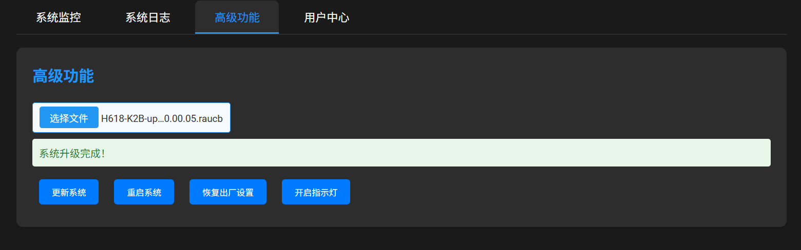

# 主板说明

## H618-kickpi
- 淘宝购买，2GB RAM + 8GB 存储，价格约150元。
- 基于野火开源主板 lubancat A1 重新制作，基本兼容 A1 源码。

## RK3399-custom
- 类似 firefly rk3399-pc 主板，供电方式不同，推测为早期 rk3399-pc 板卡。
- 主要自用，后续以 H618-kickpi 为主力支持对象。

---

## 上电开机与网络配置
- 上电后需先配置网络。
- H618-kickpi 当前有线网口未适配，推荐使用 5G WiFi。

### 配网方式
1. USB 配网：
   - 使用 Type-C 线连接电脑 USB 口。
   - 打开串口终端（推荐 mobaxterm、windterm），波特率任意（模拟串口）。
   - 打开后无提示，直接输入：
     ```
     wifi -s <ssid> -p <passwd>
     ```
   - 连接成功后会显示获取到的 IP。
2. 电脑浏览器访问 `http://<ip>:4000` 进入管理后台。
3. 建议重启后再访问 `http://<ip>:8123` 进入 Home Assistant 页面。

---

## 后台管理功能
- 性能监控
  
- 日志查看
- 系统更新
  
- 恢复出厂设置
- 系统重启
- 指示灯控制

> 可将管理页面添加到 Home Assistant 导航栏，便于快速访问。

## 指示灯说明
- 指示灯常亮：系统正常启动
- 指示灯快闪：未连接无线或者有线
- 指示灯慢闪：无线或者有线已连接，但无网络
- 指示灯心跳：网络连接正常
- 指示灯长灭：人为关闭指示灯或者系统未启动